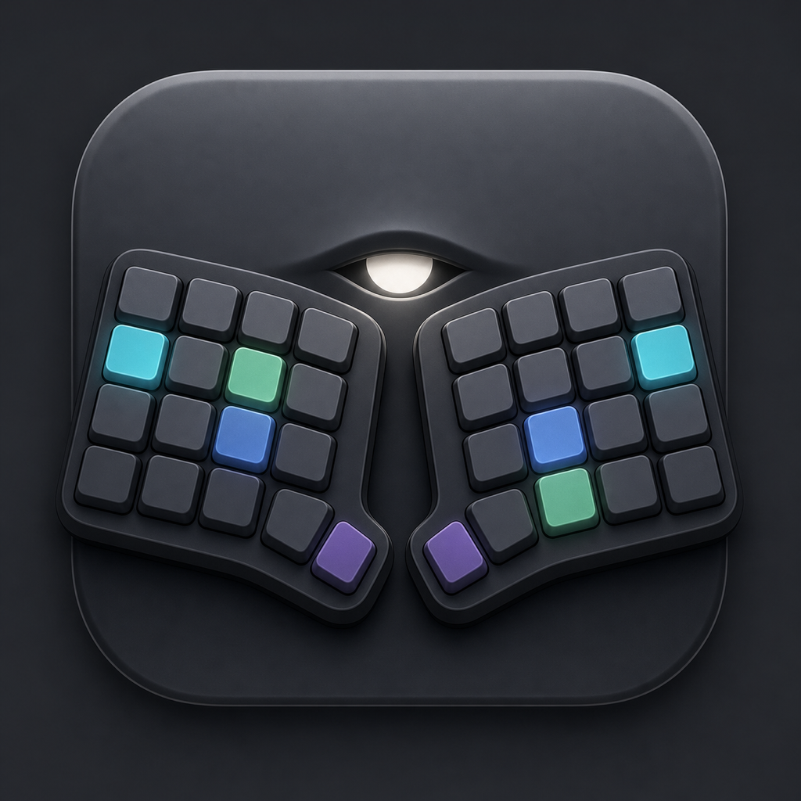

# KeyPeek 

KeyPeek provides a live on-screen overlay of your keyboard, mirroring the active base and momentary layers. It is especially useful when learning complex multi-layer layouts or using boards with missing legends. The overlay updates instantly when layers change, so the view always matches your firmware state. KeyPeek currently supports QMK, Vial, and ZMK keyboards.


## Setup

KeyPeek requires a small firmware module because stock QMK/Vial/ZMK firmware does not expose live layer-change events.
The module adds that event stream over the device connection, so the overlay stays in sync with your active layers in real time.

### QMK and Vial

1. In your QMK userspace (or `qmk_firmware`) root, add the module repo:
   
   ```sh
   mkdir -p modules
   git submodule add https://github.com/srwi/qmk-modules.git modules/srwi
   git submodule update --init --recursive
   ```
   
2. In your keymap folder, add `srwi/keypeek_layer_notify` to `keymap.json`:
   
   ```json
   {
     "modules": [
       "srwi/keypeek_layer_notify"
     ]
   }
   ```
   
3. In the same keymap folder, enable RAW HID and VIA in `rules.mk`:
   
   ```make
   RAW_ENABLE = yes
   VIA_ENABLE = yes
   ```
   
4. Build and flash your firmware:
   
   ```sh
   qmk compile -kb <your_keyboard> -km <your_keymap>
   ```
   
5. **QMK only:** Export layout information to `keyboard_info.json`:
   
   ```sh
   qmk info -kb <your_keyboard> -m -f json > keyboard_info.json
   ```
   
   This last step is only required for QMK keyboards, because VIA does not provide physical layout data directly over the connection. Vial keyboards do not require this step, as the layout data is transmitted when connecting the keyboard to KeyPeek.

### ZMK

1. Add the KeyPeek module to your `zmk-config/config/west.yml`:

   ```yaml
   manifest:
     remotes:
       - name: zmkfirmware
         url-base: https://github.com/zmkfirmware
       - name: zzeneg # <-- required for Raw HID module
         url-base: https://github.com/zzeneg
       - name: srwi # <-- required for KeyPeek module
         url-base: https://github.com/srwi
     projects:
       - name: zmk
         remote: zmkfirmware
         revision: main
         import: app/west.yml
       - name: zmk-raw-hid # <-- Raw HID module
         remote: zzeneg
         revision: main
       - name: zmk-keypeek-layer-notifier # <-- KeyPeek module
         remote: srwi
         revision: master
   ```

2. Add the `raw_hid_adapter` as an additional shield to your build, e.g. in `build.yaml`:
   
   ```yaml
   include:
     - board: nice_nano_v2
       shield: <existing shields> raw_hid_adapter # <-- required for Raw HID support
       snippet: studio-rpc-usb-uart # <-- required for ZMK Studio support
   ```
   
   **Note:** If you are using a split keyboard, the change above is only required for the central half.

3. Enable ZMK Studio support in your `.conf` file:
   
   ```conf
   CONFIG_ZMK_STUDIO=y
   ```
   
   If your keyboard does not support ZMK Studio yet, adding support is described in the [ZMK documentation](https://zmk.dev/docs/features/studio#adding-zmk-studio-support-to-a-keyboard).

KeyPeek will read layout and keymap directly from the device for ZMK without requiring additional configuration.

> [!NOTE]
> If the keyboard has been paired via Bluetooth before enabling raw HID support, re-pairing may be necessary to allow the new communication channel.

## Usage

Devices are scanned when the app starts and whenever Settings opens. Use the refresh button next to the device picker to scan again at any time. For QMK you will be prompted to select the `keyboard_info.json` generated from your keymap when you connect. For Vial and ZMK, just select the connected device from the dropdown, since they provide layout information directly.

Every successful connection with a stable device identity is saved once under **Connection** in Settings. QMK connections remember the canonical `keyboard_info.json` path and selected layout. Vial and ZMK read their layout and keymap from the keyboard again when they connect. ZMK serial devices without a USB serial number can connect manually, but are not saved because operating systems can reuse port names. Saved connections can be enabled, disabled, connected directly, or removed. The main Connect button becomes Disconnect while a keyboard is connected.

Enable **Auto-connect** to try enabled saved connections when KeyPeek starts. **Last connected** moves a successful connection to the front. **Manual** keeps your drag-and-drop order. KeyPeek tries every enabled connection in order, waits three seconds, and repeats for five rounds. It then shows a temporary failure message and stops until the user opens Settings.

KeyPeek stores these values with the existing settings:

- macOS: `~/Library/Application Support/dev.srwi.KeyPeek/settings.ini`
- Windows: the KeyPeek application config directory under `%APPDATA%`
- Linux: the KeyPeek application config directory under `$XDG_CONFIG_HOME`, or `~/.config` when unset

**Start KeyPeek on login** appears only when the current installation supports it. KeyPeek uses the native per-user startup mechanism on each platform: ServiceManagement on macOS, the `HKCU` Run key on Windows, and XDG autostart on Linux. macOS requires a signed `.app` bundle.

For local macOS builds, set `KEYPEEK_CODESIGN_IDENTITY` to a stable development or self-signed certificate name, then run `scripts/bundle-macos.sh`. The helper does not change the bundle identifier and deliberately refuses ad-hoc signing so macOS sees a stable app identity.

To build, sign, and install a development build as an absolute symlink in `~/Applications`, run:

```bash
export KEYPEEK_CODESIGN_IDENTITY="Apple Development: you@example.com (TEAMID)"
scripts/bundle-macos.sh --install
```

The first run preserves an existing non-symlink `~/Applications/KeyPeek.app` as a timestamped backup. Later runs update the symlink in place. Because the link points into `target/release`, rerun the command after `cargo clean` or after moving the repository.


# License & Attribution

Parts of this project are based on code from [the VIA project](https://github.com/the-via/app), which is licensed under the GNU General Public License v3.0.
